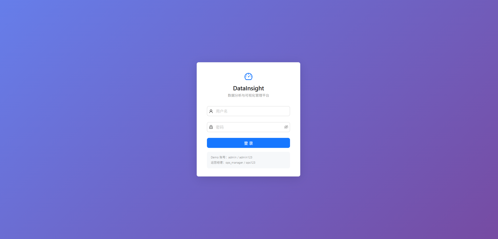
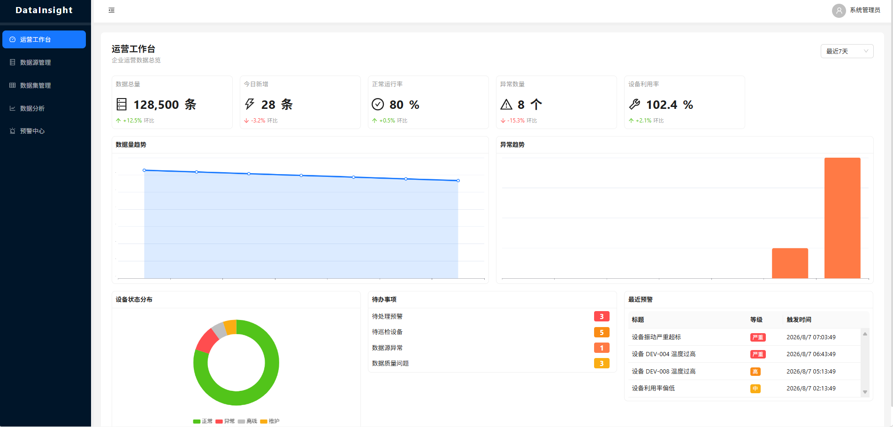
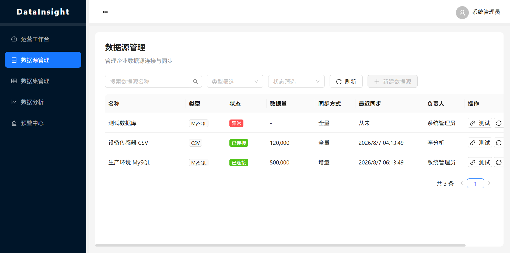
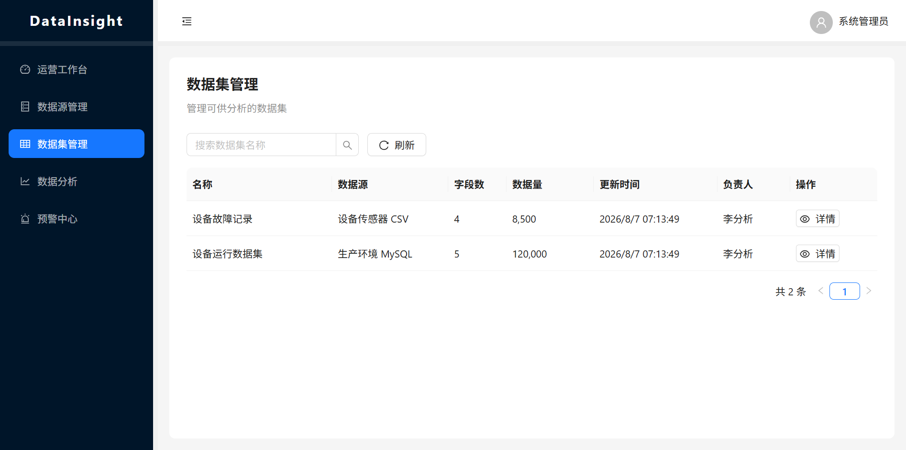
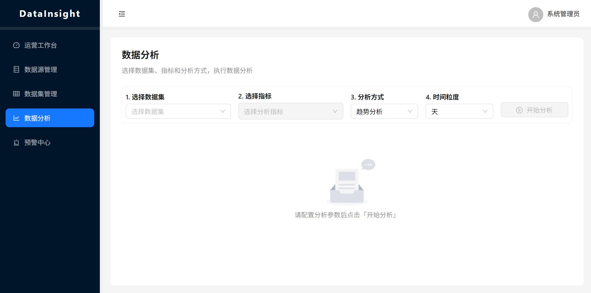
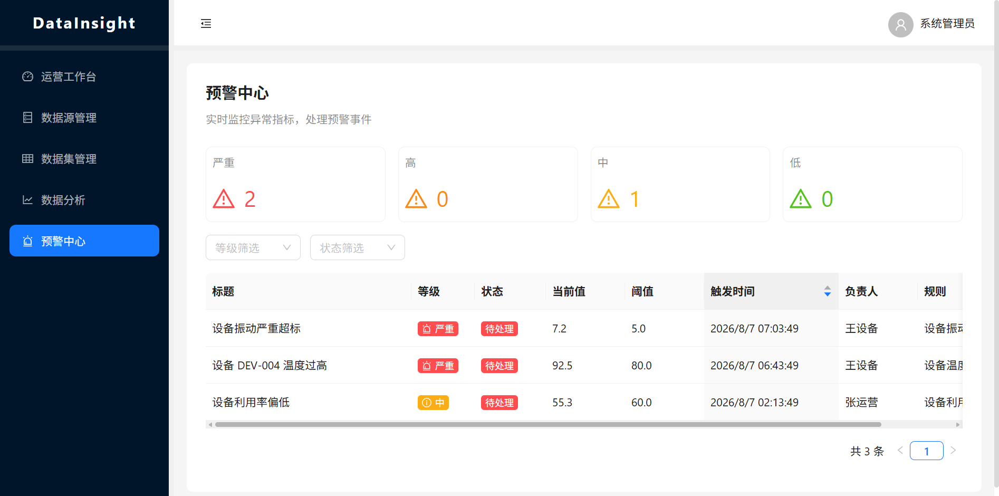

# DataInsight — 数据分析与可视化管理平台

> **面向企业运营管理的数据分析 SaaS 产品，将原始业务数据转化为可辅助决策的数据资产。**

[](https://github.com/your-org/datainsight/releases)
[](./LICENSE)
[](https://react.dev)
[](https://www.typescriptlang.org/)
[](https://www.python.org/)
[](https://fastapi.tiangolo.com/)
[](https://www.mysql.com/)

---

## 📌 项目简介

**DataInsight** 是一个面向企业运营管理、设备管理和数据分析人员的数据分析与可视化管理平台。平台通过 **数据采集 → 数据清洗 → 数据标准化 → 指标计算 → 数据分析 → 可视化展示 → 异常识别 → 预警 → 智能巡检** 的完整数据链路，将企业分散的原始业务数据转化为能够辅助运营决策的数据产品。

与传统的"数据大屏展示工具"不同，DataInsight 是一套完整的 **数据运营闭环系统**：不只看数据，更要发现问题、推动处理、形成管理动作。

---

## 🎯 产品定位

| 维度 | 说明 |
|------|------|
| **产品类型** | B2B 企业级数据分析 SaaS 平台 |
| **目标用户** | 运营经理、数据分析师、设备管理员、系统管理员 |
| **核心场景** | 企业运营监控、设备运维管理、数据驱动决策 |
| **差异化** | 数据→分析→异常→预警→处理→再分析的完整闭环 |
| **商业模式** | SaaS 订阅制 + 私有化部署可选 |

---

## 🚀 核心功能

### 🔌 数据管理
- **多数据源接入**：支持 MySQL、PostgreSQL、MongoDB、REST API、CSV/Excel 导入
- **数据集管理**：数据源组合、字段映射、数据预处理
- **数据质量管理**：完整性、准确性、重复率、异常值监控
- **数据同步调度**：全量/增量同步、定时任务、失败重试

### 📊 数据分析
- **指标分析工作台**：自定义指标 + 维度 + 筛选条件的灵活分析引擎
- **趋势分析**：多时间粒度（时/日/周/月/季/年）的趋势可视化
- **对比分析**：同比、环比、自定义周期对比
- **异常分析**：基于统计学和规则的异常自动识别
- **排名分析**：Top N / Bottom N 排行

### 📈 可视化看板
- **运营总览看板**：核心 KPI + 趋势 + 状态分布 + 待办事项
- **自定义看板**：拖拽式布局、20+ 图表组件
- **设备运营看板**：设备状态、利用率、故障分布
- **实时刷新**：关键指标实时更新（WebSocket）

### ⚠️ 预警中心
- **预警规则引擎**：指标 + 条件 + 阈值 + 持续时间的多维度规则配置
- **四级预警等级**：低 / 中 / 高 / 严重
- **多渠道通知**：系统内通知 + 邮件 + 短信 + 企业微信/钉钉
- **预警处理闭环**：触发 → 通知 → 确认 → 处理 → 关闭 → 沉淀

### 🔍 智能巡检
- **巡检计划管理**：定时巡检、周期配置、执行范围
- **巡检任务执行**：自动执行 + 人工复核
- **异常设备追踪**：设备状态流转、故障记录
- **巡检报告生成**：自动生成巡检报告归档

### 📋 数据报表
- **报表模板**：预置运营日报、周报、月报模板
- **定时报表**：按计划自动生成并推送
- **数据导出**：PDF / Excel / CSV 多格式导出
- **报表归档**：历史报表检索与对比

### 🔐 权限管理
- **RBAC 权限模型**：用户 → 角色 → 权限 三级管控
- **数据级权限**：按数据源、看板、报表粒度授权
- **操作审计**：全量操作日志记录
- **多角色支持**：管理员、运营经理、数据分析师、设备管理员、普通员工

---

## 📸 程序截图

### 登录页


### 运营工作台（Dashboard）


核心 KPI 卡片、数据量/异常趋势图、设备状态分布、待办事项、最近预警。

### 数据源管理


数据源列表、连接状态、类型筛选、连接测试、手动同步。

### 数据集管理


数据集列表、字段详情抽屉、数据预览。

### 数据分析工作台


数据集 → 指标 → 分析方式 → 时间粒度 四步配置，生成图表 + 摘要 + 洞察 + 数据明细。

### 预警中心


四级预警统计卡片、等级/状态筛选、实时预警列表。

---

## 🏗️ 产品架构

```
┌─────────────────────────────────────────────────────────────┐
│                        展示层 (Presentation)                  │
│  工作台  │  数据管理  │  数据分析  │  看板  │  预警  │  巡检   │
├─────────────────────────────────────────────────────────────┤
│                      业务服务层 (Business)                    │
│  指标引擎  │  规则引擎  │  预警引擎  │  报表引擎  │  巡检引擎   │
├─────────────────────────────────────────────────────────────┤
│                      数据处理层 (Data Processing)             │
│  数据采集  │  数据清洗  │  数据标准化  │  指标计算  │  ETL    │
├─────────────────────────────────────────────────────────────┤
│                      基础设施层 (Infrastructure)              │
│  用户权限  │  日志审计  │  消息通知  │  任务调度  │  配置管理  │
└─────────────────────────────────────────────────────────────┘
```

---

## 🛠️ 技术架构

| 层级 | 技术选型 | 说明 |
|------|---------|------|
| **前端框架** | React 18 + TypeScript | SPA 应用，组件化开发 |
| **状态管理** | Zustand + React Query | 全局状态 + 服务端状态分离 |
| **UI 组件库** | Ant Design 5.x | 企业级 UI 组件体系 |
| **图表库** | ECharts 5.x + D3.js | 数据可视化 |
| **构建工具** | Vite 5.x | 快速 HMR，ESBuild 构建 |
| **后端框架** | Python 3.12 + FastAPI | RESTful API，异步高性能 |
| **数据库** | MySQL 8.0 | 主数据存储 |
| **ORM** | SQLAlchemy 2.0 | 异步 ORM |
| **缓存** | Redis 7.x | Session、热点数据 |
| **数据分析** | Pandas | 聚合计算与数据清洗 |
| **定时任务** | APScheduler | 进程内任务调度 |
| **认证** | JWT + bcrypt | 身份认证与授权 |
| **容器化** | Docker + Docker Compose | 一键部署 |

---

## 📁 项目结构

```
datainsight-platform/
├── README.md                       # 项目说明（本文件）
├── PRD.md                          # 产品需求文档
├── PRODUCT_ARCHITECTURE.md         # 产品架构文档
├── DATABASE_DESIGN.md              # 数据库设计文档
├── API.md                          # API 接口规划文档
├── CHANGELOG.md                    # 版本更新日志
├── RELEASE_PLAN.md                 # 版本发布计划
├── .gitignore                      # Git 忽略配置
│
├── redmine/                        # Redmine 研发管理文档
│   ├── epics.md                    # Epic 规划
│   ├── user-stories.md             # User Story 列表
│   ├── tasks.md                    # Task 拆解
│   ├── bugs.md                     # Bug 跟踪模板
│   └── releases.md                 # 版本管理
│
├── frontend/                       # 前端项目
│   ├── src/
│   │   ├── components/             # 通用组件
│   │   ├── pages/                  # 页面
│   │   ├── hooks/                  # 自定义 Hooks
│   │   ├── stores/                 # 状态管理
│   │   ├── services/               # API 服务层
│   │   ├── utils/                  # 工具函数
│   │   ├── types/                  # TypeScript 类型定义
│   │   └── assets/                 # 静态资源
│   ├── public/
│   ├── package.json
│   ├── tsconfig.json
│   └── vite.config.ts
│
├── backend/                        # 后端项目
│   ├── src/
│   │   ├── controllers/            # 控制器
│   │   ├── services/               # 业务服务
│   │   ├── models/                 # 数据模型
│   │   ├── middleware/             # 中间件
│   │   ├── routes/                 # 路由
│   │   ├── jobs/                   # 定时任务
│   │   ├── utils/                  # 工具函数
│   │   └── config/                 # 配置
│   ├── migrations/                 # 数据库迁移
│   ├── seeds/                      # 种子数据
│   ├── tests/                      # 测试
│   ├── package.json
│   └── tsconfig.json
│
├── docs/                           # 补充文档
│   ├── user-guide.md               # 用户手册
│   ├── deployment.md               # 部署文档
│   └── development.md              # 开发指南
│
└── mock/                           # Mock 数据
    ├── dashboard.json
    ├── data-sources.json
    └── alerts.json
```

---

## ⚡ 快速开始

### 环境要求

- **Node.js** >= 20.x
- **pnpm** >= 8.x（推荐）或 npm >= 10.x
- **PostgreSQL** >= 16.x
- **Redis** >= 7.x
- **Docker** & **Docker Compose**（可选，用于快速部署）

### 本地开发

#### 1. 克隆项目

```bash
git clone https://github.com/your-org/datainsight-platform.git
cd datainsight-platform
```

#### 2. 启动基础设施（Docker）

```bash
docker-compose up -d postgres redis elasticsearch minio
```

#### 3. 初始化数据库

```bash
cd backend
pnpm install
pnpm run db:migrate
pnpm run db:seed
```

#### 4. 启动后端服务

```bash
pnpm run dev
# API 运行在 http://localhost:3000/api
```

#### 5. 启动前端应用

```bash
cd frontend
pnpm install
pnpm run dev
# 前端运行在 http://localhost:5173
```

### Docker 一键部署

```bash
docker-compose up -d
# 访问 http://localhost:8080
```

---

## 🔑 Demo 账号

| 角色 | 用户名 | 密码 | 权限说明 |
|------|--------|------|---------|
| 系统管理员 | `admin` | `admin123` | 全部功能 + 系统配置 |
| 运营经理 | `ops_manager` | `ops123` | 看板/分析/预警/报表 |
| 数据分析师 | `analyst` | `analyst123` | 数据管理/分析/看板 |
| 设备管理员 | `device_admin` | `device123` | 设备监控/巡检 |
| 普通员工 | `staff` | `staff123` | 被授权内容只读 |

---

## 📊 产品迭代计划

| 版本 | 代号 | 核心功能 | 状态 |
|------|------|---------|------|
| **v1.0** | MVP | 数据源、数据集、数据清洗、核心指标、基础 Dashboard、基础分析 | 🚧 开发中 |
| **v1.1** | Analysis | 趋势分析、异常分析、预警中心 | 📋 规划中 |
| **v1.2** | Alert & Inspection | 智能巡检、报表中心、权限管理 | 📋 规划中 |
| **v2.0** | Advanced | 高级分析、自定义 Dashboard、更多数据源、智能洞察 | 💡 构思中 |

> 详细版本规划参见 [RELEASE_PLAN.md](./RELEASE_PLAN.md)

---

## 📈 性能指标

| 指标 | 目标值 | 测量方式 |
|------|--------|---------|
| Dashboard 首屏加载 | < 2s | Lighthouse Performance Score ≥ 90 |
| 千级数据分析耗时 | < 5s | 后端 API 响应时间 |
| 全量数据分析耗时 | < 30s | 全表扫描场景 |
| 数据采集成功率 | ≥ 99.5% | 采集日志统计 |
| 预警触达延迟 | < 30s | 预警触发到推送时间差 |
| API 响应时间 (P95) | < 500ms | APM 监控 |
| 页面交互响应 | < 200ms | 用户操作反馈时间 |
| 系统可用性 | ≥ 99.9% | 全年宕机时间 < 8.76h |

---

## 🏆 项目亮点

### 产品维度
1. **完整数据闭环**：不是"做一张大屏"，而是构建数据→指标→分析→异常→预警→处理→再分析的运营闭环
2. **真实 B 端逻辑**：多角色权限体系、数据级权限隔离、操作审计追溯
3. **分析工作台**：灵活的多维度分析引擎，而非固定报表
4. **预警规则引擎**：可配置的阈值+持续时间+多条件的复合规则
5. **MVP 渐进迭代**：先验证核心链路，再逐步扩展功能深度

### 技术维度
1. **前后端分离架构**：RESTful API + TypeScript 全栈
2. **RBAC 权限模型**：用户→角色→权限，支持数据级隔离
3. **实时通信**：WebSocket 推送实时预警与数据更新
4. **可扩展性**：微服务就绪的模块化设计
5. **容器化部署**：Docker Compose 一键启动全套服务

### 工程维度
1. **完整的产品文档体系**：PRD + 架构设计 + 数据库设计 + API 规划 + 研发任务拆解
2. **Redmine 项目管理**：Epic → Story → Task 三级任务拆解
3. **版本规划清晰**：从 MVP 到 v2.0 的渐进式迭代路径
4. **测试策略**：单元测试 + 集成测试 + E2E 测试

---

## 👤 关于作者

本项目作为企业级 B 端产品作品，展示了从 **产品规划 → 架构设计 → 技术选型 → 数据库设计 → API 设计 → 项目管理 → 前端实现** 的完整产品研发流程。

**负责范围**：
- 产品定位与需求分析（PRD）
- 信息架构与功能架构设计
- 数据库设计与 ER 建模
- API 接口规划
- 前端架构与核心页面开发
- 研发任务拆解与版本管理
- 可视化看板与数据分析功能

**技术栈覆盖**：React / TypeScript / Node.js / PostgreSQL / Redis / ECharts / Docker

---

## 📄 许可证

本项目采用 [MIT License](./LICENSE) 开源。

---

## 📮 联系方式

如有任何问题或建议，欢迎通过以下方式联系：

- **GitHub Issues**：[提交 Issue](https://github.com/your-org/datainsight-platform/issues)
- **Email**：developer@datainsight.dev

---

<p align="center">
  <b>DataInsight</b> — 让数据驱动决策，让异常无处遁形。
</p>
