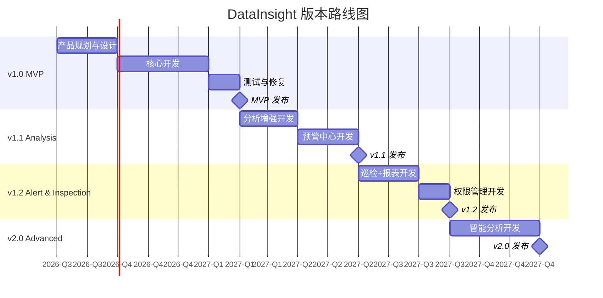

# DataInsight — 版本发布计划

> **日期**：2026-08-06 | **产品版本策略**：MVP → 渐进迭代

---

## 版本总览

```
v1.0 MVP                  v1.1 Analysis           v1.2 Alert &          v2.0 Advanced
2026-Q3/Q4                2026-Q4/2027-Q1         Inspection            2027-Q2/Q3
│                         │                      2027-Q1/Q2            │
├── 数据源管理             ├── 趋势分析            ├── 智能巡检           ├── 高级分析
├── 数据集管理             ├── 对比分析            ├── 报表中心           ├── 自定义看板增强
├── 数据清洗               ├── 异常分析            ├── 权限管理           ├── 智能数据洞察
├── 核心指标               ├── 预警中心            └── 数据质量增强       ├── 移动端适配
├── 基础 Dashboard         └── 通知系统                                ├── 更多数据源
├── 基础指标分析                                                       ├── ML 异常检测
└── 用户登录                                                           └── API 开放平台
```

---

## v1.0 MVP（最小可行产品）

**代号**：Foundation  
**时间**：2026-Q3 启动，Q3/Q4 发布  
**目标**：搭建核心数据链路，验证产品价值

### 功能范围

| 模块 | 功能 | 优先级 | 说明 |
|------|------|--------|------|
| **认证** | 用户登录/登出 | P0 | JWT 认证 |
| **工作台** | 运营总览 Dashboard | P0 | KPI + 趋势 + 待办 |
| **数据管理** | 数据源 CRUD | P0 | MySQL + CSV 两种类型 |
| | 数据源连接测试 | P0 | |
| | 数据源手动同步 | P0 | 全量同步 |
| | 数据集 CRUD | P0 | |
| | 数据集数据预览 | P0 | |
| | 基础数据清洗 | P1 | 去重 + 缺失值检测 |
| | 数据同步日志 | P1 | |
| **数据分析** | 指标分析工作台 | P0 | 数据集→指标→维度→时间→筛选→分析 |
| | 基础图表渲染 | P0 | 折线图、柱状图、饼图、表格 |
| **看板** | 企业总览看板 | P0 | 系统预置 |
| | 看板查看 | P0 | |
| **系统** | 基础用户管理 | P1 | 仅列表+状态切换 |

### 不包含
- ❌ 趋势分析独立页面 → v1.1
- ❌ 对比分析、异常分析 → v1.1
- ❌ 预警中心 → v1.1
- ❌ 智能巡检 → v1.2
- ❌ 报表中心 → v1.2
- ❌ 完整 RBAC 权限 → v1.2
- ❌ 自定义看板编辑器 → v2.0
- ❌ 移动端 → v2.0

### 为什么这些功能在 MVP？

| 功能 | 理由 |
|------|------|
| 数据源 + 数据集 | 没有数据就没有一切。这是整个平台的数据基础 |
| 基础 Dashboard | 用户每天进入系统的第一页，核心价值感知点 |
| 指标分析工作台 | 数据分析的核心能力，验证分析引擎设计 |
| 企业总览看板 | 预置看板让用户开箱即用 |

### 为什么这些功能不在 MVP？

| 功能 | 理由 |
|------|------|
| 预警中心 | 需要先有数据积累和指标基线，否则规则无法配置 |
| 智能巡检 | 依赖预警和设备的完整数据 |
| 报表中心 | 在看板和分析能力成熟前，报表价值有限 |
| 权限管理 | MVP 阶段用户量小，角色预置即可满足 |
| 自定义看板 | 需要先验证预置看板的价值和交互模式 |

---

## v1.1 Analysis（分析增强）

**代号**：Analysis  
**时间**：2026-Q4 / 2027-Q1  
**目标**：从"看数据"到"分析数据"，建立主动发现能力

### 功能范围

| 模块 | 功能 | 优先级 |
|------|------|--------|
| **数据分析** | 趋势分析独立页面 | P0 |
| | 对比分析（同比/环比/自定义） | P0 |
| | 异常分析（统计异常+规则异常） | P0 |
| | 排名分析 | P1 |
| | 数据洞察自动生成 | P1 |
| **预警中心** | 预警规则引擎 | P0 |
| | 实时预警列表 | P0 |
| | 预警处理流程（确认→处理→关闭） | P0 |
| | 系统内通知 | P0 |
| | 邮件通知 | P1 |
| | 预警记录归档 | P1 |
| **数据管理** | 增量同步 | P1 |
| | 数据质量报告 | P1 |

### 为什么 v1.1 做预警中心？

在 v1.0 有了数据积累和指标基线后：
- 用户对数据波动有了感知
- 可以基于历史数据设置合理的阈值
- 预警规则需要指标数据支撑
- 预警处理闭环完善了产品核心链路

---

## v1.2 Alert & Inspection（运营闭环）

**代号**：Alert & Inspection  
**时间**：2027-Q1 / Q2  
**目标**：完成"数据→分析→预警→处理→巡检→再分析"的完整闭环

### 功能范围

| 模块 | 功能 | 优先级 |
|------|------|--------|
| **智能巡检** | 巡检计划管理 | P0 |
| | 巡检任务生成与执行 | P0 |
| | 异常设备列表 | P0 |
| | 巡检记录查询 | P0 |
| | 巡检报告自动生成 | P1 |
| **数据报表** | 报表模板（日报/周报/月报） | P0 |
| | 报表生成（即时） | P0 |
| | 定时报表 | P1 |
| | PDF/Excel/CSV 导出 | P0 |
| | 报表归档 | P1 |
| **权限管理** | RBAC 完整实现 | P0 |
| | 角色权限配置界面 | P0 |
| | 数据级权限隔离 | P0 |
| | 操作日志审计 | P0 |
| **数据管理** | 数据质量增强（自动修复建议） | P1 |
| | PostgreSQL 数据源支持 | P1 |

### 为什么 v1.2 做权限管理？

- v1.0/v1.1 用户量小，预置角色够用
- v1.2 功能丰富后，不同角色使用的模块分化明显
- 数据级权限是企业级产品的必要要求
- 操作日志是安全合规的基础

---

## v2.0 Advanced Analytics（智能升级）

**代号**：Advanced  
**时间**：2027-Q2 / Q3  
**目标**：从描述性分析到预测性分析，提升产品智能化水平

### 功能范围

| 模块 | 功能 | 优先级 |
|------|------|--------|
| **高级分析** | 预测分析（基于历史趋势） | P0 |
| | 关联分析（指标间相关性） | P1 |
| | 归因分析（异常根因定位） | P1 |
| **自定义看板** | 拖拽式看板编辑器 | P0 |
| | 20+ 图表组件库 | P0 |
| | 看板模板市场 | P1 |
| | 看板分享与协作 | P1 |
| **数据源** | MongoDB 数据源 | P1 |
| | REST API 数据源 | P1 |
| | Excel 文件导入 | P2 |
| **智能洞察** | 自动洞察生成（NLG） | P1 |
| | 异常根因自动分析 | P1 |
| | 智能推荐（看板/指标/阈值） | P2 |
| **移动端** | 移动端 H5 适配（查看） | P2 |
| **开放平台** | REST API 开放 | P2 |
| | Webhook 回调 | P2 |

---

## 版本里程碑



---

## 版本过渡策略

### 数据兼容性
- 数据库 Migration 向前兼容
- 新版本表结构通过 ALTER TABLE + 默认值保证旧数据可读
- 不删除旧字段，使用 `deleted_at` 标记废弃

### API 兼容性
- v1 阶段 API 路径不含版本号
- v2 阶段引入 `/api/v2/` 前缀
- 旧版本 API 保持至少 6 个月兼容期

### 配置兼容性
- 新增配置项使用默认值
- 废弃配置项保留但不生效

---

> **文档维护**：版本计划每季度评审一次，根据用户反馈和市场变化调整优先级。
